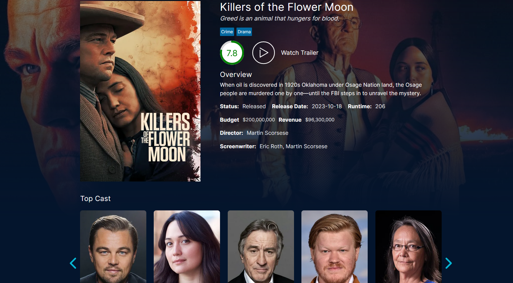
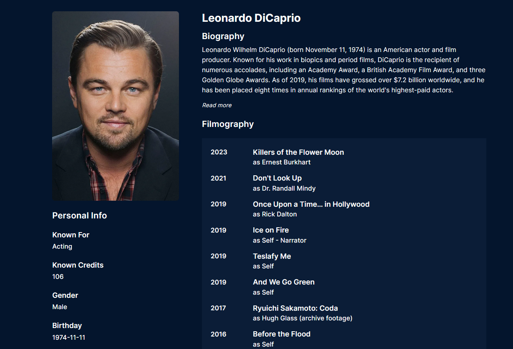
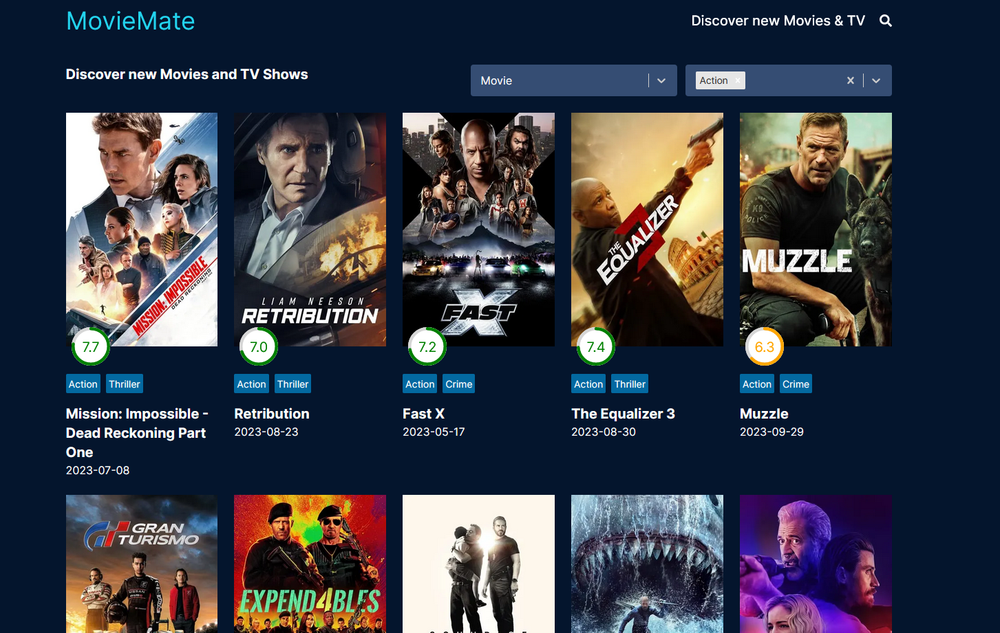

# Movie-Mate

> Movie-Mate - app that uses TMDB API for searching movies, actors, and directors, viewing ratings, reviews, and trailers.
>
> Live demo [_here_](https://movie-mate-beta.vercel.app/) (If the application is not loading data, try using a VPN)

## Table of Contents
* [Technologies Used](#technologies-used)
* [Features](#features)
* [Screenshots](#screenshots)

## Technologies Used

- Nextjs - version 14.0.1
- React - version 18.2.0
- Typescript - version 5.1.6
- Tailwindcss - version 3.3.3

## Features

- Search movies, TV shows, and people by keyword or name
- Display detailed information about movies, including synopses, casts, crews, ratings, and reviews.
- Trending section for currently popular content, a Popular section for highly watched titles, and a Top Rated section for critically acclaimed and highly rated movies and TV shows.

## Screenshots

  
Movie Page
 

    
Person Page

    

    
Discover Page

    

    
Search Page

    

